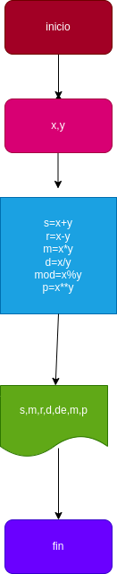

# operaciones-aritm-ticas
implementar un programa para calcular la suma esta multiplicacion division division entera y potencia de dos numeros
## calculcar mediante 2 numeros enteros varias operaciones aritmeticas

#analisis 

-variable de entrada

X y Y: 2 numeros naturales ingresados para sacarles sus operaciones aritmeticas respectivas 

-variable de salida

S:suma
R:resta
M:multiplicacion
D:division
DE: division entera 
MOD: modulo
P:potencia 

# diseña

# construccion

ejercio n.3 implementar un programa  para operaciones aritmeticas

S : X+Y
R : X-Y
M : X * y
D : X/Y
DE : X // Y
MOD: X % Y  
P : X** Y 

## este archivo esta escrito en lenguaje mark down
